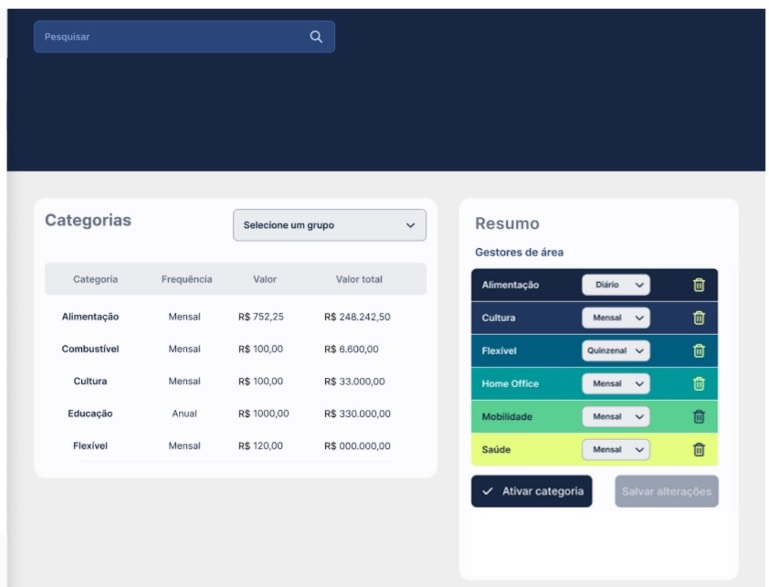
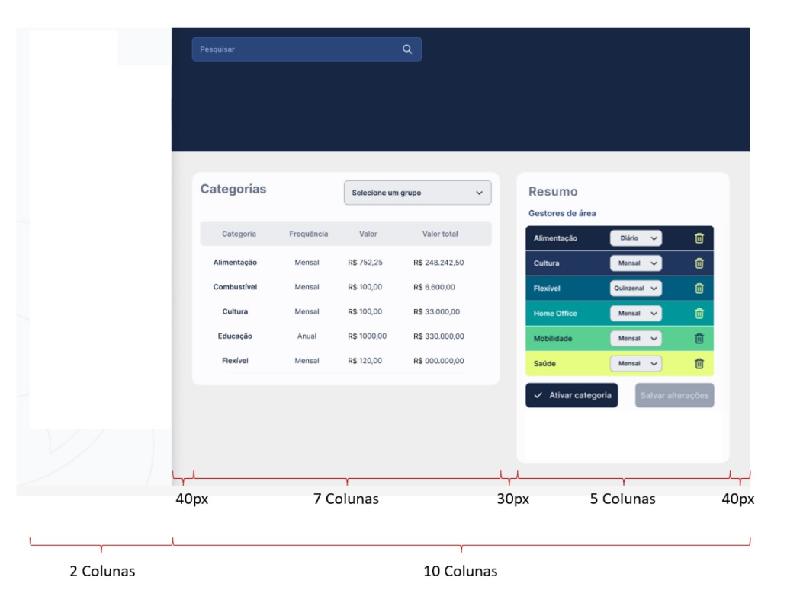
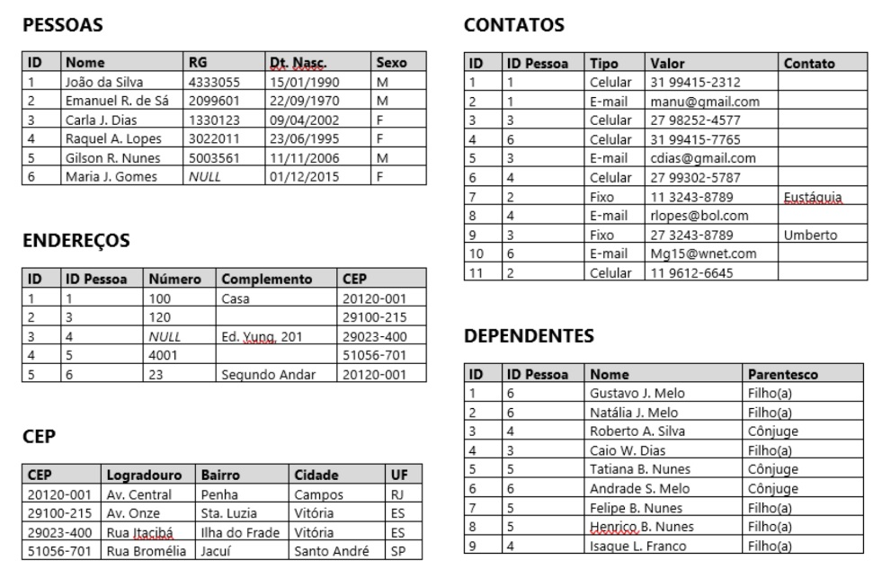
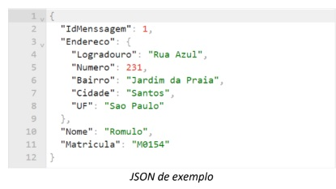
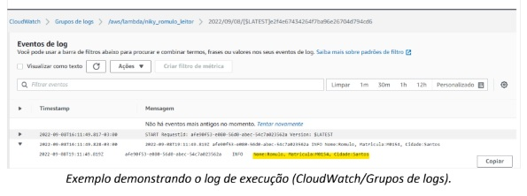

<h4 align="center"> 
	🚧 Niky 🚀
</h4>

  

    

### 💻 Sobre o desafio

Esse projeto compreende tanto disciplinas de front-end quanto de back-end.

O teste deve ser realizado com React e Node, mas o objetivo é analisar o seu entendimento dos conceitos e das boas práticas de desenvolvimento.

### ✅ Requisitos

- [x] Um repositório no GitHub onde subirá todo código das funcionalidades desenvolvidas e os
arquivos SQL gerados.
- [ ] Uma conta em uma plataforma de aplicação gratuita de sua preferência, onde você publicará as APIs que criar.
- [ ] Uma conta gratuita para construir uma fila SQS.

### 🎨 Tarefas Frontend

- Criar o layout a seguir

  - [ ] a. considerando o padrão Bootstrap de divisão em 12 colunas, respeitando os espaçamentos descritos na imagem
  - [ ] b. demais espaçamentos, alturas e larguras dos objetos podem ser aplicados conforme o seu bom senso 
  - [ ] c. OBJETIVO: Analisar a sua capacidade de converter layouts entregues pela equipe de produtos em telas de sistema
  - [ ] d. Utilizar react para construir o design.

9. Faça uma análise crítica do protótipo do item 6 do frontend 

- [ ] a. indique pontos de melhoria do layout apresentado. 
- [ ] b. Exemplo: Cores, espalhamentos, tamanho de fonte, alinhamento de objetos e texto, larguras, etc.
- [ ] c. OBJETIVO: Analisar seu senso crítico e capacidade de colaborar com o fluxo produtivo como um todo.

10.  Usando o layout criado, no “gestor de categorias”, implemente javascripts que permitam:

- [ ] a. Ao clicar em um dos ícones “lixeira” presentes nas linhas de categoria, a mensagem de
confirmação: “Deseja excluir essa categoria?” seja exibida. 
- [ ] b. Se o usuário confirmar a exclusão, a linha onde o botão está posicionado seja removida;
- [ ] c. Uma mensagem de erro seja disparada se a frequência informada no combo da linha que está sendo excluída for igual a “mensal”;
- [ ] d. OBJETIVO: Testar sua capacidade em implementar ações no lado do cliente.

### 🚀 Tarefas Backend

1. Proponha um modelo de dados e o represente em um DER (diagrama de entidade
relacionamento) que contemple a situação descrita abaixo:

**ACADEMIA DE GINÁSTICA**

Uma academia de ginástica deseja manter um controle do seu
funcionamento. Os alunos são organizados em turmas associadas a um
tipo específico de atividade. As informações sobre uma turma são
quantidade máxima de alunos, horário da aula, duração da aula, data
inicial, data final e tipo de atividade.

Cada turma é orientada por um único instrutor para o qual são
cadastrados RG, nome, data de nascimento, titulação e todos os
telefones possíveis para sua localização. Um instrutor pode orientar
várias turmas que podem ser de diferentes atividades. Para cada turma
existe um aluno monitor que auxilia o instrutor da turma, sendo que um
aluno pode ser monitor no máximo em uma turma.

Os dados cadastrados dos alunos são: código de matrícula, data de
matrícula, nome, endereço, telefone, data de nascimento, altura e peso.

Um aluno pode estar matriculado em várias turmas se deseja realizar
atividades diferentes e para cada matrícula é mantido um registro das
presenças e ausências do aluno.

**Garantias**

- [ ] a. todas as entidades possuam nome
- [ ] b. todos os atributos listados estejam representados
- [ ] c. que sejam definidos os tipos de dados para cada atributo (utilize INT para números inteiros, VARCHAR para strings, BOOL para booleanos, FLOAT para números decimais, DATE para datas, e TIME para horas)
- [ ] d. que seja possível identificar os relacionamentos entre as entidades
- [ ] e. seja possível identificar as chaves em cada entidade
- [ ] f. utilize a ferramenta de sua escolha para a construção do DER (Miro, Draw.io, Lucid, ou qualquer outro que desejar)
- [ ] g. Entregue como resultado uma imagem (com boa definição) de seu diagrama.
- [ ] h. OBJETIVO: Compreender o seu quanto de conhecimento em relação à modelagem de dados relacionais e sua capacidade de interpretar um caso de uso e traduzi-lo em um modelo de dados aplicável.

2. Considerando o caso de uso do item 1 do backend: 

**Garantias**

- [ ] a. demonstrar as classes
- [ ] b. propor os métodos necessários para as classes identificadas
- [ ] c. justificar o motivo de sua criação 
- [ ] d. OBJETIVO: Compreender o quanto de conhecimento você possui em relação à programação orientada a objetos e sua capacidade de aplicá-la em um caso de uso apresentado.

3. Ainda baseado no caso de uso do item 1 do backend: 

**Garantias**

- [ ] a. monte os contratos dos métodos necessários para implementar o cadastro dos alunos e turmas (CRUD), contemplando as particularidades apresentadas no texto.
- [ ] b. OBJETIVO: Compreender a sua capacidade prática em transformar um caso de uso em APIs REST.

4. Baseado nos contratos criados no item 3 do backend:  

**Garantias**

- [ ] a. implemente as APIs persistindo os dados em um banco de dados relacional
- [ ] b. suba o código no GitHub 
- [ ] c. OBJETIVO: Compreender a sua capacidade prática em desenvolvimento back-end.

5. As tabelas abaixo estão representadas uma estrutura de dados de um cadastro de pessoa:

Com base nas tabelas acima, escreva queries que atendam às necessidades descritas nos tópicos a seguir.

**Garantias**

- [ ] a. Para etiquetar uma remessa de correspondência, crie uma query que apresente o nome da
pessoa e seu endereço. Importante: Apenas pessoas com endereço devem ser exibidas na
lista 
- [ ] b. Para que possamos alertar a equipe responsável, crie uma query que identifique eventuais
pessoas que não possuam endereço 
- [ ] c. Levando em conta que todos os campos do cadastro dos dados pessoa são obrigatórios, crie
uma query que apresente as pessoas que possuem erro em seu cadastro, para que a equipe
possa complementá-lo
- [ ] d. Monte uma lista telefônica com “Nome”, “Sexo”, “Telefone” e “Contato”, onde telefone deve
exibir celular ou fixo. Importante: Todas as pessoas devem ser exibidas na lista, mesmo quem
não tenha telefone
- [ ] e. Crie uma query que apresente as pessoas com mais de 1 filho 
- [ ] f. OBJETIVO: Compreender seu nível de conhecimento sobre a construção de queries SQL a partir
da compreensão de um modelo de dados simples. 

7. Conforme as informações da tabela abaixo:

- [ ] a. Criar uma API mock [GET]/categorias que entregue em um JSON as informações
- [ ] b. publicar no Heroku ou em outra hospedagem gratuita que julgar mais simples para você 
- [ ] c. OBJETIVO: Entender se você conhece o conceito de mock e tem habilidade de realizar uma
publicação em ambiente real.

8. Utilizando a API [GET]/categorias do item 7 do backend

- [ ] a. apresentar a tela que você criou no item 6 do frontend consumindo os dados e montando dinamicamente as 2 tabelas existentes na tela.
- [ ] b. Obs: Caso você não tenha respondido a questão anterior, você pode utilizar o seguinte serviço:
https://ufmsd4brfl.execute-api.us-east-1.amazonaws.com/avaliacao-niky/categorias
- [ ] c. OBJETIVO: Analisar a sua capacidade de converter layouts entregues pela equipe de produtos em
telas de sistema.

11. Usando a AWS gratuitamente 

- [ ] a. criar uma fila SQS atachada com uma trigger Lambda que leia a
mensagem entregue e grave no log de execução o conteúdo do JSON 

Para evidenciar seu desenvolvimento print:

- [ ] b. A tela que demonstra a vinculação da fila com o lambda;
- [ ] c. O código do serviço lambda;
- [ ] d. A tela do log de execução com o conteúdo, conforme exemplo abaixo.

- [ ] e. OBJETIVO: Compreender se você possui os conhecimentos básicos para operar uma fila de
processamento assíncrono.

### 💡 Referências

- [ ] tarefa

### 📅 Entregas

- [ ] tarefa

### 🚀 Conclusão

Esse projeto avalia a habilidade de realizar tarefas de frontend e backend juntamente com soft skills, como, a compreensão e interpretação das tarefas em texto, buscar respostas e perguntar a outros membros da equipe conforme os processos de desenvolvimento em equipe.

Feito com ❤️ por Douglas A B Novato. 👋🏽 [Entre em contato!](https://www.linkedin.com/in/douglasabnovato/)
 
Fonte do projeto na [niky](https://www.niky.com.vc/) 👋  